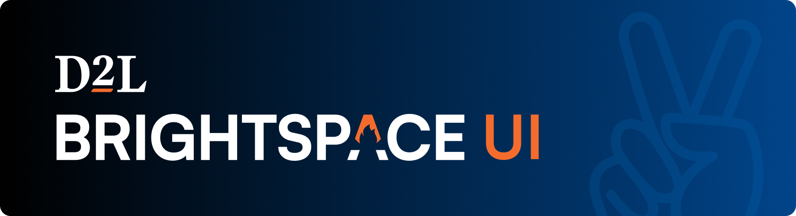

# Brightspace UI by D2L

A collection of tools and components for building a highly accessible and internally consistent UI for Brightspace and other D2L products — free and open source!

At [D2L](https://www.d2l.com) we're passionate about creating best-in-class, easy-to-use, and accessible experiences for learning. To get started, check out the [@brightspace-ui/core](https://github.com/BrightspaceUI/core) repo where you can find the web components that form the foundation of our Daylight design system.

Components are all tested for quality and accessibility including [axe tests](https://www.deque.com/axe/devtools/) and [Visual Difference tests](https://github.com/BrightspaceUI/testing).
